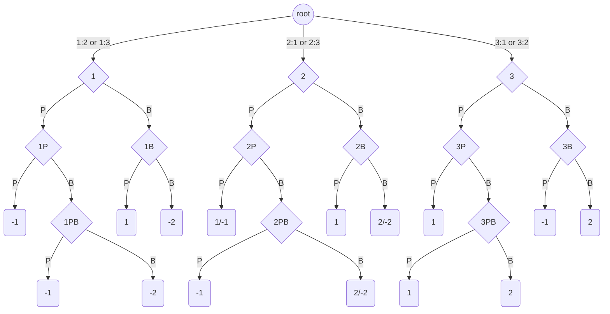

# GameTheory_CFR

* **Counterfactual Regret Minimization**

## 1. cfr_practice

This is a python version of some examples code from [An Introduction to Counterfactual Regret Minimization](http://modelai.gettysburg.edu/2013/cfr/cfr.pdf). Including Rock-Paper-Scissors(RPS), Kuhn Poker, Liar’s Dice.

### 1.1 Paper outline

* **Regret Matching and Minimization**
  * Worked example: RPS regret minimization
  * Exercise: RPS equilibrium, Colonel Blotto
* **Counterfactual Regret Minimization (CFR)**
  * Worked example: Kuhn Poker equilibrium
  * Exercise: 1-die-versus-1-die Dudo
* **Fixed-Strategy Iteration Counterfactual Regret Minimization (FSICFR)**
  * Worked example: Liar Die
  * Exercise: 1-die-versus-1-die Dudo with 3 claim memory limit
* **Exploiting Mistakes (Opponent)**
  * Exercise: Perturbed Liar Die

### 1.2 RPS

Rock-Scissors-Paper (RPS) is a two-player game where players each simultaneously make one of three gestures: rock (a closed fist), paper (an open face-down palm), or scissors (exactly two fingers extended).

|      |   R  |   P  |   S  |
|:----:|:----:|:----:|:----:|
|&nbsp;&emsp;**R**&emsp;|&emsp;0, 0&emsp;|&emsp;-1,1&emsp;|&emsp;1,-1&emsp;|
|&nbsp;&emsp;**P**&emsp;|&emsp;1,-1&emsp;|&emsp;0, 0&emsp;|&emsp;-1,1&emsp;|
|&nbsp;&emsp;**S**&emsp;|&emsp;-1,1&emsp;|&emsp;1,-1&emsp;|&emsp;0, 0&emsp;|

### 1.3 Kuhn Poker

Kuhn Poker is a simple 3-card poker game by Harold E. Kuhn. Two players each ante 1 chip, i.e. bet 1 chip blind into the pot before the deal. Three cards, marked with numbers 1, 2, and 3, are shuffled, and one card is dealt to each player and held as private information.

* **Sequential Actions:** Player 1 $\rightarrow$ Player 2 $\rightarrow$ Player 1

|Player 1|Player 2|Player 1|&emsp;&emsp;&emsp;&emsp;&nbsp;Payoff|
|   :-:  |   :-:  |   :-:  |   :-   |
|pass|pass|    |+1 to player with higher card|
|pass|bet |pass|+1 to player 2               |
|pass|bet |bet |+2 to player with higher card|
|bet |pass|    |+1 to player 1               |
|bet |bet |    |+2 to player with higher card|

* **Kuhn Poker Node**

### 1.4 Liar Die

Dudo is a bluffing dice game thought to originate from the Inca Empire circa 15th century. Many variations exist in both folk and commercial forms. The ruleset we use from is perhaps the simplest representative form, and is thus most easily accessible to both players and researchers. Liar's Dice, Bluff, Call My Bluff, Perudo, Cacho, Cachito are names of variations. For detailed rules, please read [Liar's Dice Rules](https://www.dicegamedepot.com/liars-dice-rules/).

* **1-Die-Versus-1-Die Dudo (2 players with 1 die each)**
We are limited to two 6-sided dice, yielding 13 possible actions: 12 claims of 1 or 2 of 6 different ranks, plus the doubting "dudo" action. Let us index claims in increasing order of strength starting at 0, and let the "dudo" action have index 12.

  

  |Strength $s(n,r)$| 0 | 1 | 2 | 3 | 4 | 5 | 6 | 7 | 8 | 9 | 10| 11|
  |       :-:       |:-:|:-:|:-:|:-:|:-:|:-:|:-:|:-:|:-:|:-:|:-:|:-:|
  |**Claim $n × r$**|$1×2$|$1×3$|$1×4$|$1×5$|$1×6$|$1×1$|$2×2$|$2×3$|$2×4$|$2×5$|$2×6$|$2×1$|
  